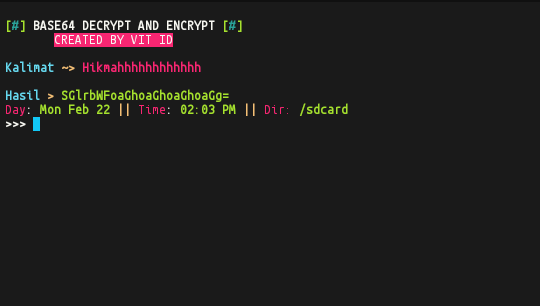

### BASE64 Encrypt and Decrypt use PHP
 Adalah sebuah program encrypt dan decrypt password base64 yang dibuat menggunakan bahasa pemrograman PHP

### Screenshots

### Installation
- apt update && apt upgrade
- apt install git
- apt install php
- git clone https://github.com/DavitID/base64php
- cd base64php
- php enc.php
